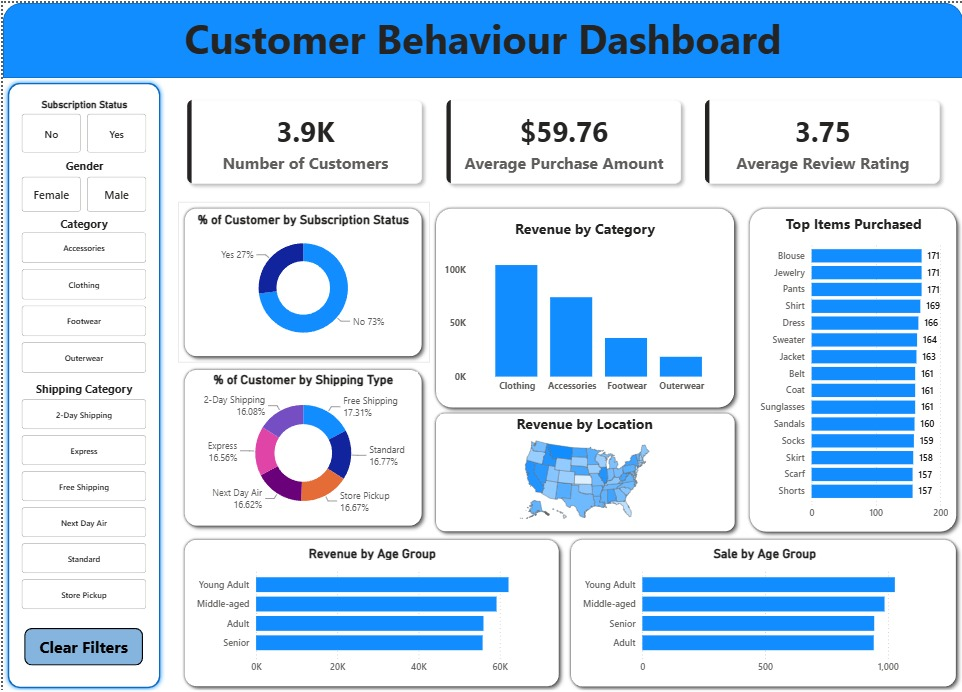

# Customer Shopping Behavior Analytics

An end-to-end data analytics project focused on analyzing customer shopping behavior using **Python, PostgreSQL, and Power BI**. This project explores transactional data to uncover customer spending patterns, product preferences, subscription behavior, and shipping trends to support business decision-making.

## Project Overview

This project follows a complete analytics pipeline:

**Data Cleaning & Preparation (Python) → Data Storage (PostgreSQL) → Business Analysis (SQL) → Dashboard Visualization (Power BI)**

The goal is to transform raw e-commerce data into meaningful insights that can drive customer retention, marketing strategies, and product optimization.

## Data Cleaning & Preparation (Python)

### Tasks Performed

✔ Loaded dataset using Pandas  
✔ Checked data types and null values  
✔ Performed exploratory data analysis  
✔ Imputed missing values in `review_rating` using category-wise median  
✔ Renamed columns into snake_case  
✔ Created new features:
- `age_group`
- `purchase_frequency_days`

✔ Removed redundant columns after consistency checks  
✔ Loaded cleaned dataset into PostgreSQL

## Key Insights (SQL)

### Customer Behavior
- Male customers generated significantly higher revenue.
- Young adults contributed the highest revenue among all age groups.

### Subscription Analysis
- Non-subscribers spent slightly more on average.
- Subscription conversion can be improved.

### Product Insights
- Clothing category generated the highest revenue.
- Accessories and top-rated products have strong potential for promotions.

### Shipping Behavior
- Express shipping customers showed slightly higher average purchase amounts.

## Power BI Dashboard

